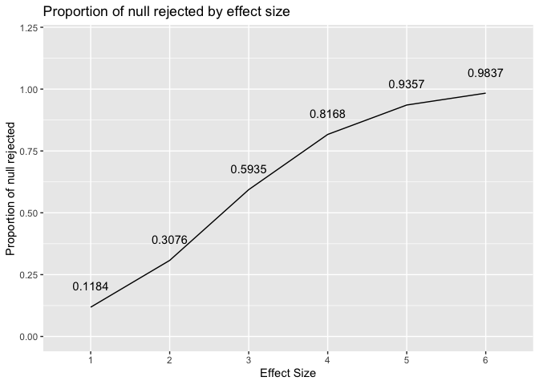
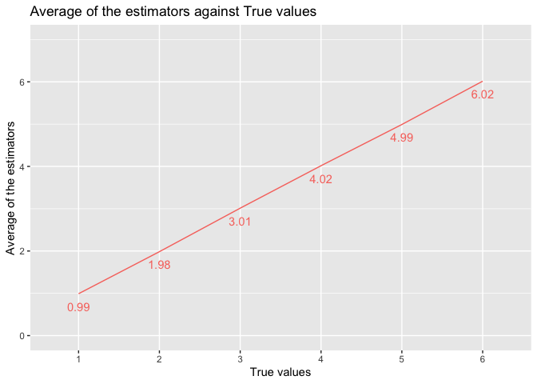
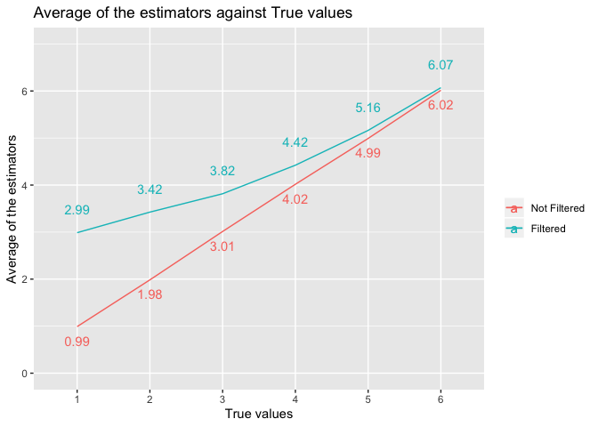

p8105\_hw5\_xm2229
================
Xiaoyue Ma
11/9/2019

## Problem 1

``` r
library(tidyverse)
```

    ## ── Attaching packages ─────────────────────────────── tidyverse 1.2.1 ──

    ## ✔ ggplot2 3.2.1     ✔ purrr   0.3.3
    ## ✔ tibble  2.1.3     ✔ dplyr   0.8.3
    ## ✔ tidyr   1.0.0     ✔ stringr 1.4.0
    ## ✔ readr   1.3.1     ✔ forcats 0.4.0

    ## ── Conflicts ────────────────────────────────── tidyverse_conflicts() ──
    ## ✖ dplyr::filter() masks stats::filter()
    ## ✖ dplyr::lag()    masks stats::lag()

``` r
set.seed(10)

iris_with_missing = iris %>%
  map_df(~replace(.x, sample(1:150, 20), NA)) %>%
  mutate(Species = as.character(Species))
```

There are two cases to address:

  - For numeric variables, you should fill in missing values with the
    mean of non-missing values
  - For character variables, you should fill in missing values with
    `virginica`

Write a function that takes a vector as an argument; replaces missing
values using the rules defined above; and returns the resulting vector.

``` r
rule_rep = function(vector) {
  type = typeof(vector)
  if (type == "character") {
    new_v = replace_na(vector, "virginica")
  } else {
    new_v = replace_na(vector, mean(vector, na.rm = TRUE))
  }
  return(new_v)
}
```

Apply this function to the columns of `iris_with_missing` using a `map`
statement. The table printed below is the first 22 lines of the columns
of `iris_with_missing` after applying the function and we can see that
indeed, all `NA` values has been replaced strictlly following the rules
provided above.

``` r
iris_with_missing %>%
  map_df(~rule_rep(.x)) %>%
  head(22) %>%
  knitr::kable()
```

| Sepal.Length | Sepal.Width | Petal.Length | Petal.Width | Species   |
| -----------: | ----------: | -----------: | ----------: | :-------- |
|     5.100000 |    3.500000 |     1.400000 |    0.200000 | setosa    |
|     4.900000 |    3.000000 |     1.400000 |    0.200000 | setosa    |
|     4.700000 |    3.200000 |     1.300000 |    0.200000 | setosa    |
|     4.600000 |    3.100000 |     1.500000 |    1.192308 | setosa    |
|     5.000000 |    3.600000 |     1.400000 |    0.200000 | setosa    |
|     5.400000 |    3.900000 |     1.700000 |    0.400000 | setosa    |
|     5.819231 |    3.400000 |     1.400000 |    0.300000 | setosa    |
|     5.000000 |    3.400000 |     1.500000 |    0.200000 | setosa    |
|     4.400000 |    2.900000 |     1.400000 |    0.200000 | setosa    |
|     4.900000 |    3.100000 |     3.765385 |    0.100000 | setosa    |
|     5.400000 |    3.075385 |     1.500000 |    0.200000 | setosa    |
|     4.800000 |    3.400000 |     1.600000 |    0.200000 | setosa    |
|     5.819231 |    3.075385 |     1.400000 |    0.100000 | setosa    |
|     4.300000 |    3.000000 |     3.765385 |    0.100000 | setosa    |
|     5.819231 |    4.000000 |     3.765385 |    0.200000 | setosa    |
|     5.700000 |    4.400000 |     1.500000 |    0.400000 | setosa    |
|     5.400000 |    3.900000 |     1.300000 |    0.400000 | setosa    |
|     5.100000 |    3.500000 |     1.400000 |    1.192308 | setosa    |
|     5.700000 |    3.800000 |     1.700000 |    0.300000 | setosa    |
|     5.100000 |    3.800000 |     1.500000 |    1.192308 | setosa    |
|     5.400000 |    3.400000 |     1.700000 |    0.200000 | setosa    |
|     5.100000 |    3.700000 |     1.500000 |    0.400000 | virginica |

## Problem 2

Create a tidy dataframe containing data from all participants, including
the subject ID, arm, and observations over time:

  - Start with a dataframe containing all file names; the `list.files`
    function will help
  - Iterate over file names and read in data for each subject using
    `purrr::map` and saving the result as a new variable in the
    dataframe
  - Tidy the result; manipulate file names to include control arm and
    subject ID, make sure weekly observations are “tidy”, and do any
    other tidying that’s necessary

<!-- end list -->

``` r
path_to_dir = "./data"

## a helper function for 
## 1. concatenating path to file
## 2. read the file as dataframe
## 3. append arm and subject ID
read_files = function(x){
  # concatenate the path to directory with file name
  path_to_file = paste(path_to_dir, x, sep = "/")
  # read in the data as a dataframe
  row = read_csv(path_to_file)
  # extract string from file name
  splited_file = unlist(strsplit(x, ".", fixed = TRUE))
  # extract arm group and id
  arm_id = unlist(strsplit(splited_file[1], "_", fixed = TRUE))
  # append arm group and id
  row$arm = arm_id[1]
  row$id = as.integer(arm_id[2])
  return(row)
}

arm = purrr::map(list.files(path_to_dir), read_files) %>%
  bind_rows() %>%
  pivot_longer(cols = starts_with("week"), 
               names_to = "week",
               names_prefix = "week_",
               values_to = "data") %>%
  mutate(week = as.integer(week),
         arm = forcats::fct_relevel(arm, "con", "exp")) %>%
  janitor::clean_names()
```

The tidyed data is called `arm`. It contains 4 columns and 160
observations. The columns are:

  - `arm`: a factor column that contains whether if a sample is control
    group ( **con** ) or experiemental group ( **exp** )
  - `id`: contains the id of the sample
  - `week`: contains the number of week the observation belong, which is
    an integer column
  - `data`: contains all the data measured in the longitudinal study

Below is a spaghetti plot showing observations on each subject over
time. According to the plot, there is clearly a trend that the
experimental group has a signifcant growth as time past and the control
group stays the same.

``` r
arm %>% 
  ggplot(aes(x = week, y = data, group = arm, color = arm)) +
  geom_path() + 
  labs(title = "Data measured on control group and experimental group by week", colour = "ARM groups") + 
  ylab("Measured Data") + 
  xlab("Number of Week")
```

<!-- -->

## Problem 3

Below is a function that generate 1 dataset according to the design
elements. And the table below is first 6 rows of a sample dataset
generated by the function.

``` r
generate_dataset = function(n=30, beta_0=2, var=50, beta_1=0){
  dataset = data.frame(y = rep(0,n), x = rep(0,n))
  for (j in 1:n){
    # draw xi1
    dataset[j, 2] = rnorm(1)
    # draw error
    error = rnorm(1, mean = 0, sd = sqrt(var))
    # calculate yi
    dataset[j, 1] = beta_0 + beta_1 * dataset[j, 2] + error
  }
  return(dataset)
}

head(generate_dataset(beta_1 = 1)) %>% knitr::kable()
```

|           y |           x |
| ----------: | ----------: |
|  16.2469216 | \-0.6458861 |
|   7.2626266 |   0.2273595 |
|   1.6876172 |   0.5470484 |
| \-1.3910312 | \-0.7106992 |
|   0.3873522 | \-1.1392413 |
|   5.6142668 |   0.3237956 |

A function that calculate \(\hat{\beta_1}\) and p-value for **N**
generated dataset given the value of number of dataset wanted to
generate and the value of \(\beta_1\). Table below are the fist 6 rows
of the values of \(\hat{\beta_1}\) and their corresponding p-value for
the 10000 generated dataset, when \(\beta_1 = 0\).

``` r
result_cal = function(N= 10000, b_1 = 0){
  result = data.frame(estimator = rep(0, N), p_value = rep(0,N))
  for (i in 1:N){
    ds = generate_dataset(beta_1 = b_1)
    output = lm(y~x, data = ds) %>%
      broom::tidy() %>%
      select(estimate, p.value)
    result[i,1] = output[2,1]
    result[i,2] = output[2,2]
  }
  return(result)
}

zero = result_cal()
head(zero) %>% knitr::kable()
```

|   estimator |  p\_value |
| ----------: | --------: |
|   0.7682974 | 0.5205227 |
|   2.4211499 | 0.1694209 |
|   0.7220804 | 0.5741016 |
|   0.0207519 | 0.9863650 |
|   0.4078518 | 0.7716390 |
| \-1.4924970 | 0.2071019 |

Repeat the above for \(\beta_1=\{1,2,3,4,5,6\}\) compute the estimators
and the p-values for 10000. All the data is stored in one dataframe
called `simulation`

``` r
## helper function to generate result for each dataset
## and append the beta value in the last column
build_ds = function(x){
  est = result_cal(b_1 = x)
  est$beta = x
  return(est)
}

simulation = purrr::map(1:6, build_ds) %>%
  bind_rows()
```

Make a plot showing the proportion of times the null was rejected (the
power of the test) on the y axis and the true value of \(\beta_1\) on
the x axis. From the graph below, we can see that as the effect size
grow, more null hypothesis got rejected, which means more estimated beta
is significant.

``` r
alpha = 0.05

simulation %>%
  mutate(power = ifelse(p_value >= alpha, 0, 1)) %>%
  group_by(beta) %>%
  summarise(proportion = sum(power)/n()) %>%
  ggplot(aes(x= beta, y = proportion)) +
  geom_path() + ylim(0, 1.2) + xlab("Effect Size") + ylab("Proportion of null rejected") + 
  scale_x_discrete(limits=c("1","2","3","4","5","6")) +
  geom_text(aes(label=proportion), hjust = 0.5, vjust = -2) + 
  labs(title = "Proportion of null rejected by effect size")
```

<!-- -->

Make a plot showing the average estimate of \(\hat{\beta_1}\) on the y
axis and the true value of \(\beta_1\) on the x axis. From this graph,
we can say that there is a perfect linear relationship between the two.
As the true value increases, the average of the estimators will also
increase.

``` r
plot1 = simulation %>%
  group_by(beta) %>%
  summarise(average = mean(estimator)) %>%
  ggplot(aes(x= beta, y = average, color = "darkblue")) +
  geom_path() + 
  scale_x_discrete(limits=c("1","2","3","4","5","6")) +
  geom_text(aes(label=round(average,2)), hjust = 0.5, vjust = 2) + ylim(0,7)
  
  
plot1 + labs(title = "Average of the estimators against True values")+ xlab("True values") + ylab("Average of the estimators") +
  theme(legend.position = "none")
```

<!-- -->

Make a second plot (or overlay on the first) the average estimate of
\(\hat{\beta_1}\) only in samples for which the null was rejected on the
y axis and the true value of \(\beta_1\) on the x axis. According to the
graph below, the sample average of \(\hat{\beta_1}\) across tests for
which the null is rejected approximately equal to the true value of
\(\beta_1\) when the effect size is large. When the true value of
\(\beta_1\) is small, there is a significant difference. This is becuase
that as the effect size grow larger the power of the test is stronger.
Therefore, the test will be less like to be wrong when the true value of
\(\beta\) is further away from zero on number line.

``` r
filtered_avearge <- simulation %>%
  mutate(power = ifelse(p_value >= alpha, 0, 1)) %>%
  filter(power == 1) %>%
  group_by(beta)%>%
  summarise(average = mean(estimator))

plot1 + geom_path(data=filtered_avearge, aes(color="red")) + 
  geom_text(data=filtered_avearge,
            aes(label = round(average, 2), color = "red"),
            vjust = -2) + 
  scale_color_discrete(name = "", labels = c("Not Filtered", "Filtered")) + 
  labs(title = "Average of the estimators against True values") + 
  ylab("Average of the estimators") + xlab("True values")
```

<!-- -->
