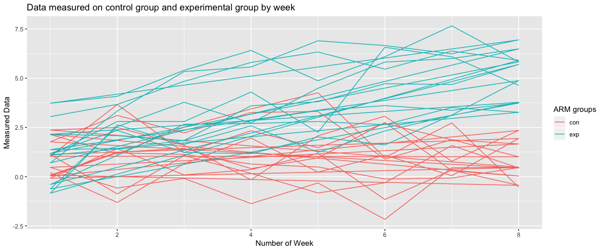

p8105\_hw5\_xm2229
================
Xiaoyue Ma
11/9/2019

## Problem 1

``` r
library(tidyverse)
```

    ## ── Attaching packages ─────────────────────────────── tidyverse 1.2.1 ──

    ## ✔ ggplot2 3.2.1     ✔ purrr   0.3.3
    ## ✔ tibble  2.1.3     ✔ dplyr   0.8.3
    ## ✔ tidyr   1.0.0     ✔ stringr 1.4.0
    ## ✔ readr   1.3.1     ✔ forcats 0.4.0

    ## ── Conflicts ────────────────────────────────── tidyverse_conflicts() ──
    ## ✖ dplyr::filter() masks stats::filter()
    ## ✖ dplyr::lag()    masks stats::lag()

``` r
set.seed(10)

iris_with_missing = iris %>%
  map_df(~replace(.x, sample(1:150, 20), NA)) %>%
  mutate(Species = as.character(Species))
```

There are two cases to address:

  - For numeric variables, you should fill in missing values with the
    mean of non-missing values
  - For character variables, you should fill in missing values with
    `virginica`

Write a function that takes a vector as an argument; replaces missing
values using the rules defined above; and returns the resulting vector.

``` r
rule_rep = function(vector) {
  type = typeof(vector)
  if (type == "character") {
    new_v = replace_na(vector, "virginica")
  } else {
    new_v = replace_na(vector, mean(vector, na.rm = TRUE))
  }
  return(new_v)
}
```

Apply this function to the columns of `iris_with_missing` using a `map`
statement. The table printed below is the first 22 lines of the columns
of `iris_with_missing` after applying the function and we can see that
indeed, all `NA` values has been replaced strictlly following the rules
provided above.

``` r
iris_with_missing %>%
  map_df(~rule_rep(.x)) %>%
  head(22) %>%
  knitr::kable()
```

| Sepal.Length | Sepal.Width | Petal.Length | Petal.Width | Species   |
| -----------: | ----------: | -----------: | ----------: | :-------- |
|     5.100000 |    3.500000 |     1.400000 |    0.200000 | setosa    |
|     4.900000 |    3.000000 |     1.400000 |    0.200000 | setosa    |
|     4.700000 |    3.200000 |     1.300000 |    0.200000 | setosa    |
|     4.600000 |    3.100000 |     1.500000 |    1.192308 | setosa    |
|     5.000000 |    3.600000 |     1.400000 |    0.200000 | setosa    |
|     5.400000 |    3.900000 |     1.700000 |    0.400000 | setosa    |
|     5.819231 |    3.400000 |     1.400000 |    0.300000 | setosa    |
|     5.000000 |    3.400000 |     1.500000 |    0.200000 | setosa    |
|     4.400000 |    2.900000 |     1.400000 |    0.200000 | setosa    |
|     4.900000 |    3.100000 |     3.765385 |    0.100000 | setosa    |
|     5.400000 |    3.075385 |     1.500000 |    0.200000 | setosa    |
|     4.800000 |    3.400000 |     1.600000 |    0.200000 | setosa    |
|     5.819231 |    3.075385 |     1.400000 |    0.100000 | setosa    |
|     4.300000 |    3.000000 |     3.765385 |    0.100000 | setosa    |
|     5.819231 |    4.000000 |     3.765385 |    0.200000 | setosa    |
|     5.700000 |    4.400000 |     1.500000 |    0.400000 | setosa    |
|     5.400000 |    3.900000 |     1.300000 |    0.400000 | setosa    |
|     5.100000 |    3.500000 |     1.400000 |    1.192308 | setosa    |
|     5.700000 |    3.800000 |     1.700000 |    0.300000 | setosa    |
|     5.100000 |    3.800000 |     1.500000 |    1.192308 | setosa    |
|     5.400000 |    3.400000 |     1.700000 |    0.200000 | setosa    |
|     5.100000 |    3.700000 |     1.500000 |    0.400000 | virginica |

## Problem 2

Create a tidy dataframe containing data from all participants, including
the subject ID, arm, and observations over time:

  - Start with a dataframe containing all file names; the `list.files`
    function will help
  - Iterate over file names and read in data for each subject using
    `purrr::map` and saving the result as a new variable in the
    dataframe
  - Tidy the result; manipulate file names to include control arm and
    subject ID, make sure weekly observations are “tidy”, and do any
    other tidying that’s necessary

<!-- end list -->

``` r
path_to_dir = "./data"

## a helper function for 
## 1. concatenating path to file
## 2. read the file as dataframe
## 3. append arm and subject ID
read_files = function(x){
  path_to_file = paste(path_to_dir, x, sep = "/")
  row = read_csv(path_to_file)
  splited_file = unlist(strsplit(x, ".", fixed = TRUE))
  arm_id = unlist(strsplit(splited_file[1], "_", fixed = TRUE))
  row$arm = arm_id[1]
  row$id = as.integer(arm_id[2])
  return(row)
}

arm = purrr::map(list.files(path_to_dir), read_files) %>%
  bind_rows() %>%
  pivot_longer(cols = starts_with("week"), 
               names_to = "week",
               names_prefix = "week_",
               values_to = "data") %>%
  mutate(week = as.integer(week),
         arm = forcats::fct_relevel(arm, "con", "exp")) %>%
  janitor::clean_names()
```

The tidyed data is called `arm`. It contains 4 columns and 160
observations. The columns are:

  - `arm`: a factor column that contains whether if a sample is control
    group ( **con** ) or experiemental group ( **exp** )
  - `id`: contains the id of the sample
  - `week`: contains the number of week the observation belong, which is
    an integer column
  - `data`: contains all the data measured in the longitudinal study

Below is a spaghetti plot showing observations on each subject over
time. According to the plot, there is clearly a trend that the
experimental group has a signifcant growth as time past and the control
group stays the same.

``` r
arm %>% 
  ggplot(aes(x = week, y = data, group = arm, color = arm)) +
  geom_path() + 
  labs(title = "Data measured on control group and experimental group by week", colour = "ARM groups") + 
  ylab("Measured Data") + 
  xlab("Number of Week")
```

<!-- -->
